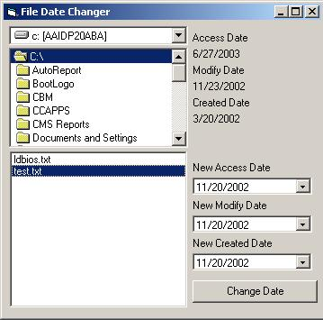



## File Date Change

### Description

This is a basic module that uses the File Date API. It includes these functions.

GetFileCreatedDate(filename as string) As Date

GetFileAccessDate(filename as string) As Date

GetFileModifyDate(filename as string) As Date

SetFileDates(filename as string,creation date as date.......) as boolean

I also included a little GUI that will let you select a file and change the date information, as an example on how to use the functions. Hope this helps someone.
 
### More Info
 

             |
---                |---
**Submitted On**   |2002-11-20 15:51:52
**By**             |[Brian Hodgen](https://github.com/Planet-Source-Code/PSCIndex/blob/master/ByAuthor/brian-hodgen.md)
**Level**          |Advanced
**User Rating**    |4.0 (16 globes from 4 users)
**Compatibility**  |VB 6\.0
**Category**       |[Windows API Call/ Explanation](https://github.com/Planet-Source-Code/PSCIndex/blob/master/ByCategory/windows-api-call-explanation__1-39.md)
**World**          |[Visual Basic](https://github.com/Planet-Source-Code/PSCIndex/blob/master/ByWorld/visual-basic.md)
**Archive File**   |[File\_Date\_15008611202002\.zip](https://github.com/Planet-Source-Code/brian-hodgen-file-date-change__1-40922/archive/master.zip)

### API Declarations

Look at code

